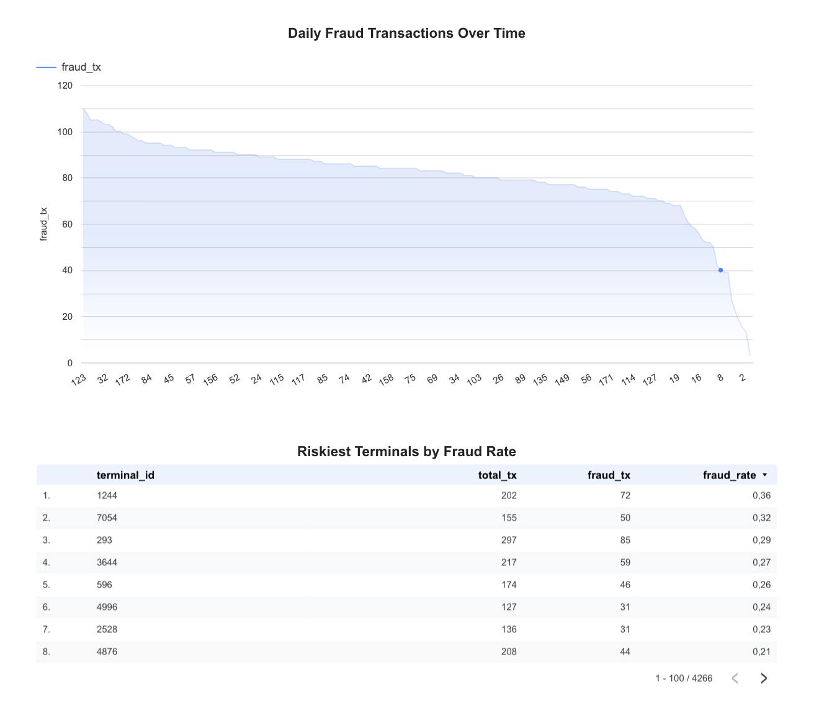
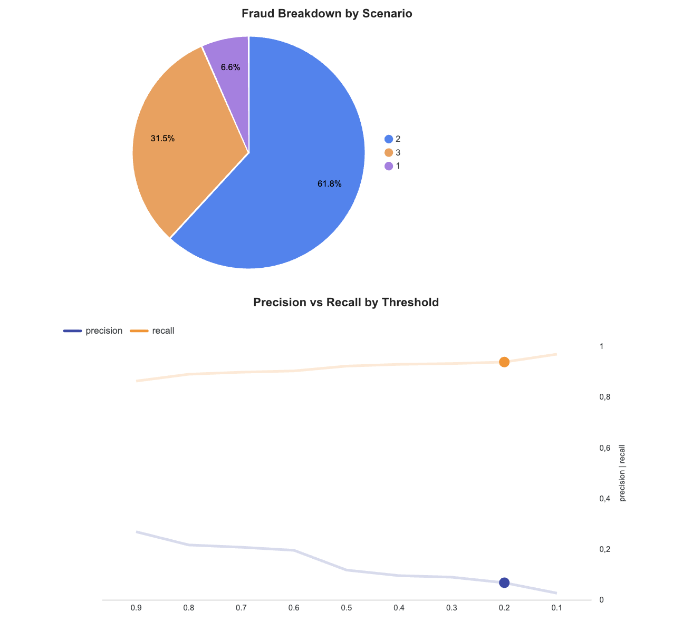
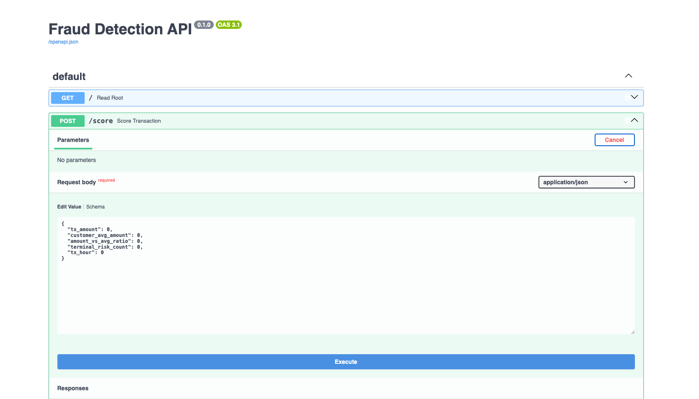

# AML Transaction Monitoring System

A fraud detection pipeline built to demonstrate anti-money-laundering (AML) transaction monitoring, combining SQL-based rule detection, machine learning, and model explainability — aimed at the finance/banking industry.

## Problem

Financial institutions need to detect fraudulent transactions in near real-time while being able to explain *why* a transaction was flagged, both for internal review and regulatory compliance. This project simulates that end-to-end workflow: from raw transaction data, to rule-based flags, to a machine learning model, to an explainable, queryable API.

## Data

No public, row-level Irish banking transaction dataset exists — the Central Credit Register holds this data but it's confidential under the Credit Reporting Act. This project instead uses the [Fraud Detection Handbook](https://fraud-detection-handbook.github.io/fraud-detection-handbook/) simulator, an open-source, research-grade synthetic data generator built specifically for teaching fraud detection.

The simulator generates ~1.75 million transactions across 5,000 customers and 10,000 terminals over 183 days, injecting three distinct fraud scenarios:
- **Scenario 1**: transactions over 220 (deterministic, sanity-check pattern)
- **Scenario 2**: compromised terminals — 2 random terminals per day flagged fraudulent for the next 28 days
- **Scenario 3**: compromised customers — 3 random customers per day, 1/3 of their transactions inflated 5x and flagged fraudulent for 14 days

Resulting fraud rate: ~0.8% of all transactions — a realistic, heavily imbalanced dataset.

## SQL rule-based detection

Before any ML model, the pipeline includes three interpretable SQL views — the kind of blunt, transparent rules real fraud teams use as a first line of defense, and a baseline the ML model needs to outperform.

```sql
-- Rule 1: large-amount flag (mirrors Scenario 1)
CREATE VIEW flagged_large_amount AS
SELECT * FROM transactions
WHERE tx_amount > 220;

-- Rule 2: terminal risk rate (mirrors Scenario 2)
CREATE VIEW flagged_terminal_risk AS
SELECT terminal_id, COUNT(*) as total_tx,
       SUM(tx_fraud) as fraud_tx,
       ROUND(SUM(tx_fraud)::NUMERIC / COUNT(*), 3) as fraud_rate
FROM transactions
GROUP BY terminal_id
HAVING SUM(tx_fraud) > 0
ORDER BY fraud_rate DESC;

-- Rule 3: customer spending-spike detection (mirrors Scenario 3)
CREATE VIEW flagged_customer_risk AS
SELECT customer_id,
       AVG(tx_amount) as avg_amount,
       MAX(tx_amount) as max_amount,
       COUNT(*) as total_tx,
       SUM(tx_fraud) as fraud_tx
FROM transactions
GROUP BY customer_id
HAVING MAX(tx_amount) > 5 * AVG(tx_amount)
ORDER BY max_amount DESC;
```

Rule 1 is a direct threshold check; rules 2 and 3 are relative/behavioral — comparing an entity to its own group or history, rather than a fixed cutoff.

## Stack

- **PostgreSQL** — transaction storage, indexed rule-based views
- **Python (pandas)** — feature engineering: rolling customer averages, amount-vs-average ratios, terminal risk counts, time-of-day features
- **LightGBM** — primary classification model, benchmarked against a logistic regression baseline
- **SHAP** — per-transaction explainability, showing which features drove each fraud flag
- **FastAPI** — `/score` (fraud probability) and `/explain` (SHAP breakdown) endpoints
- **Docker** — containerized API for portable, reproducible deployment
- **GitHub Actions** — CI pipeline verifying the Docker build on every push
- **Looker Studio** — dashboard visualizing fraud trends, terminal risk, scenario breakdown, and threshold trade-offs

## Dashboard

**[View the live dashboard →](https://datastudio.google.com/reporting/071206ce-ea1b-406f-979c-59440a6e03bb)**

**Page 1 — Fraud trends and terminal risk**

Daily fraud volume over the 183-day simulation (left), and terminals ranked by fraud rate (right) — surfacing which terminals show the strongest signs of compromise.

**Page 2 — Scenario breakdown and threshold trade-off**

Proportion of fraud attributable to each of the 3 scenarios (left), and the precision/recall trade-off across classification thresholds (right) — used to inform where to set the model's operating point based on review capacity.

## API preview


The `/score` endpoint tested via FastAPI's auto-generated interactive docs, returning a fraud probability and classification for a sample transaction. The `/explain` endpoint returns the SHAP breakdown for the same input, showing which features drove the prediction.

## Key findings

- **Model performance**: LightGBM achieved 92.1% recall (catching 92% of real fraud) at the default threshold, with a ROC-AUC of 0.966.
- **Threshold trade-off**: raising the classification threshold from 0.5 to 0.7 still catches 89.7% of fraud while cutting flagged transactions nearly in half (24,587 → 13,490) — a meaningful reduction in manual review workload for a small recall cost.
- **Explainability**: SHAP correctly attributes flags to the right underlying pattern — e.g., one flagged transaction showed a completely normal amount for that customer, but was correctly flagged due to a high-risk terminal, matching the compromised-terminal scenario.
- **Fraud composition**: 62% of all fraud came from compromised-terminal scenarios (vs. 7% large-amount, 31% compromised-customer) — sustained terminal compromise generates disproportionately more fraud volume than isolated large transactions.
- **Model comparison**: logistic regression showed numerical instability (overflow warnings) due to quasi-complete separation on the `tx_amount` feature — a known limitation of linear models when a feature has a near-deterministic relationship with the target, which LightGBM handles natively via tree splits.

## How to run

**Locally:**
```bash
python -m venv venv
source venv/bin/activate
pip install -r requirements.txt
python generate_data.py        # generates synthetic transactions
# load into PostgreSQL (see SQL section above for schema and views)
python feature_engineering.py
python train_model.py
python shap_analysis.py
uvicorn main:app --reload
```
Visit `http://127.0.0.1:8000/docs` to test the API.

**With Docker:**
```bash
docker build -t fraud-detection-api .
docker run -p 8000:8000 fraud-detection-api
```

## Limitations & next steps

- Data is synthetic; real-world transaction patterns and fraud strategies are more varied and adversarial.
- Logistic regression's numerical instability warrants further investigation (e.g. feature transformation) if used as a production baseline.
- Future work: autoencoder-based anomaly detection for catching fraud patterns beyond the three simulated scenarios; real-time streaming ingestion; a `/explain` endpoint returning natural-language summaries alongside SHAP values.